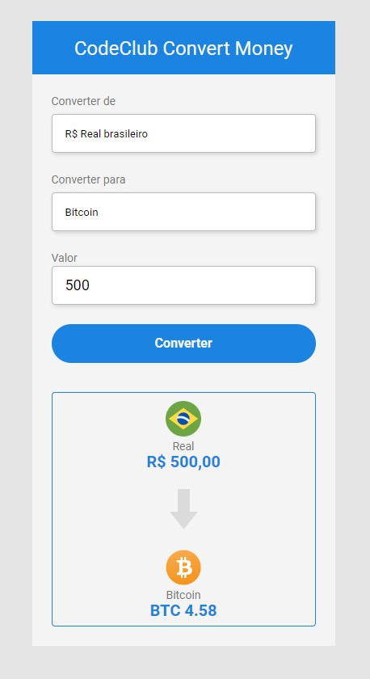
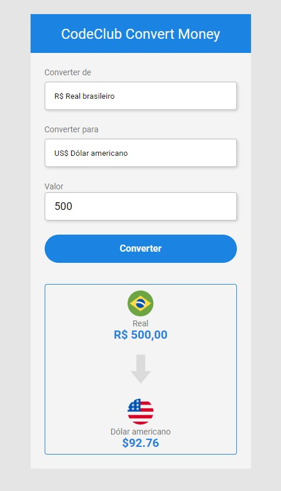
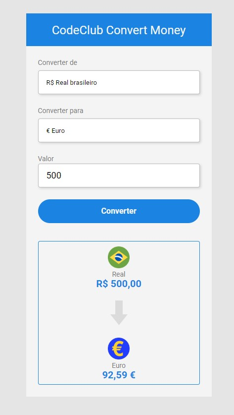

# CodeClub-Convert-Money

> Está aplicação foi desenvolvida do curso DevClub Do Rodolfo Mori 

>Este sistema foi desenvolvido com as tecnologias

- [x] HTML5
- [X] CSS3
- [X] JavaScript

 Link para acessa o sistema: Hospedado no GitHub Pages

 >[CodeClub Convert Money](https://isaiassouzasantos.github.io/CodeClub-Convert-Money/)

 >Consumindo uma API AWESOMEAD

#### Bitcoin

#### Dólar Americano

#### Euro
 

## 🤝 Desenvolvedor 

<table>
  <tr>
    <td >
      <a href="https://www.linkedin.com/in/isaiassouzasantos/">
         
        
          <b>Isaias souza</b>
        
      </a>
    </td>
  </tr>
</table>

